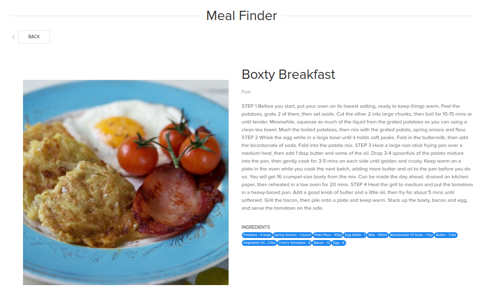

# Meal Finder 

[](https://www.npmjs.com/package/http-server)

<!--  -->

## Table of contents

- [General info](#general-info)
- [Technologies](#technologies)
- [Setup](#setup)
- [Demo](#demo)

## General info

A Single page meal finder app in vanialla JS with routing

## Technologies

Project is created with:

- Javasript
- NodeJS

## Setup

To run this project, install it locally using npm:

```
$ npm install
$ npm start
```

## Demo
